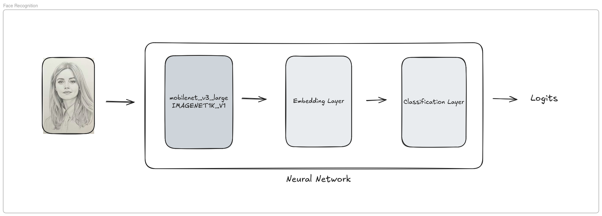
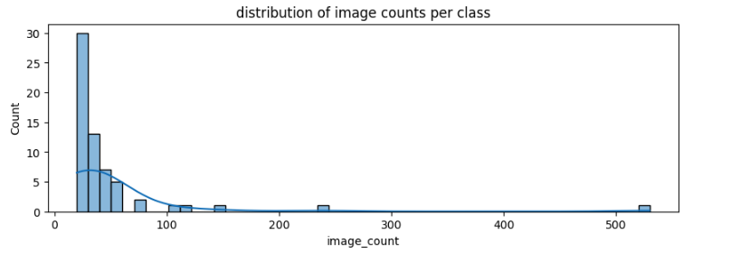

# Project Overview: Face Recognition

> [!NOTE]
> Disclaimer: This project has been developed to meet the requirements of the Machine Learning Zoomcamp capstone-1 assignment.



## Problem Description
Face recognition is a challenging computer vision task due to variations in lighting, pose, facial expression, and image quality. This project aims to build a deep learning model that can correctly identify individuals from face images using the *Labeled Faces in the Wild (LFW – People)* dataset.

The problem is framed as a supervised multi-class classification task, where each image belongs to a known person. By training a robust model, the system can learn discriminative facial features that generalize to unseen images of the same individuals.

### Who Benefits
- **ML engineers and students**: Learn how to design and train an end-to-end computer vision model.
- **Developers**: Use the project as a reference for identity recognition systems.
- **Researchers**: Explore baseline performance on a well-known face recognition dataset.

### How the Model Will Be Used
The trained model takes a face image as input and outputs class probabilities over known identities. The identity with the highest probability is selected as the prediction. This setup supports closed-set face recognition and can be integrated into applications such as access control systems, photo organization tools, or internal identity verification pipelines.

### Evaluation Metric
Since this is a multi-class classification problem, the following metric is used:

- **Accuracy**: Measures the proportion of correctly classified face images.

Accuracy serves as the primary evaluation metric, providing a clear and interpretable measure of how well the model recognizes known individuals on unseen data.

### Why This Problem Matters
Face recognition is widely used in real-world systems but remains difficult under unconstrained conditions. Solving this problem demonstrates the ability to handle image preprocessing, model training, and evaluation in a realistic ML workflow. It also aligns with the ML Zoomcamp capstone goal of applying machine learning techniques end-to-end on a practical, non-trivial problem.


## Dataset Description

### Context
The project uses the **Labeled Faces in the Wild (LFW – People)** dataset, which contains face images of public figures collected from the web. The images are captured under unconstrained, real-world conditions, resulting in significant variations in lighting, pose, facial expression, background, and image quality. This makes the dataset suitable for evaluating face recognition models in realistic scenarios rather than controlled environments.

### Features
The dataset primarily consists of image data and identity labels:

- **Face Images**: RGB images of human faces with varying resolutions and visual conditions.
- **Person ID (Label)**: The identity associated with each face image, representing the target class.
- **Image Variations**: Differences in pose, illumination, facial expression, and occlusions, implicitly encoded in the image pixels.

Each image is labeled with a known individual, making the dataset suitable for supervised learning.

### Purpose
This dataset is used to train and evaluate a face recognition model framed as a multi-class classification problem. The goal is to learn discriminative facial features that allow the model to correctly identify individuals from unseen images.

### Source
[Labeled Faces in the Wild (LFW – People) Dataset on Kaggle](https://www.kaggle.com/datasets/atulanandjha/lfwpeople)


## Exploratory Data Analysis (EDA)

### Dataset Overview
The dataset contains **3,023 face images** belonging to **62 unique individuals**. Each class represents a distinct person, making this a closed-set face recognition problem.

### Class Distribution
The number of images per individual is not perfectly uniform. Some identities have significantly more images than others, which introduces a moderate class imbalance. This reflects real-world data collection scenarios and adds complexity to the classification task.



### Sample Images
A small sample of images from the dataset shows noticeable variation in facial pose, lighting conditions, expressions, and background. These variations highlight the unconstrained nature of the dataset and the need for robust feature learning.


### Image Properties
All images share consistent spatial dimensions and color channels:

- **Image size**: 250 × 250 pixels  
- **Channels**: 3 (RGB)

This uniformity simplifies preprocessing and batching during model training.

### Data Normalization
The dataset was normalized using the following channel-wise statistics computed from the training data:

- **Mean**: `[0.4304, 0.3777, 0.3368]`
- **Standard deviation**: `[0.3000, 0.2728, 0.2655]`

Applying these normalization values helps stabilize training and improves model convergence.

This EDA step confirms that the dataset is suitable for supervised face recognition while also highlighting challenges such as class imbalance and high intra-class variation.


## Model Training

### Training Strategy
The model was trained using transfer learning with **MobileNet_V3_Large_Weights.IMAGENET1K_V1** as the pretrained backbone. This architecture was chosen for its good balance between performance and computational efficiency. To adapt the model to the face recognition task, a custom embedding head was added on top of the backbone.

Several key hyperparameters were tuned to balance generalization and convergence:

- **Embedding dimension**: 128, 256, 512  
- **Unfrozen backbone blocks**: 0 and 3  
- **Learning rate**: 0.0001, 0.001, 0.003  

### Hyperparameter Tuning
A systematic set of experiments was conducted across different combinations of embedding size, learning rate, and number of unfrozen backbone blocks. The results showed that:

- Very high learning rates led to unstable validation loss.
- Larger embedding dimensions improved model capacity but required careful learning rate selection.
- Unfreezing deeper backbone blocks improved validation accuracy when paired with a moderate learning rate.

The best configuration achieved a **validation accuracy of approximately 68%**.


### Training Process
The final model was trained for **10 epochs**. During training:

- Training accuracy increased rapidly, reaching near-perfect performance.
- Validation accuracy improved consistently and peaked at **95.14%**.
- The best-performing model checkpoint was saved based on validation accuracy.

Later epochs showed slight fluctuations in validation loss, indicating mild overfitting, which is expected given the limited dataset size.


### Final Model Selection
The model checkpoint with the highest validation accuracy was selected as the final model. This ensures that the chosen model generalizes well to unseen data rather than simply fitting the training set.

Overall, the training process demonstrates effective use of transfer learning with **MobileNet_V3_Large_Weights.IMAGENET1K_V1**, careful hyperparameter tuning, and robust model selection aligned with ML Zoomcamp best practices.


## Dependencies
The following libraries are required to run the face recognition project:

- torch
- torchvision
- onnxruntime
- numpy
- pandas
- scikit-learn
- matplotlib
- seaborn
- pillow
- tqdm
- jupyter
- fastapi[standard]
- requests

*Dependencies can be installed using any Python package manager (e.g., pip, pipenv), or by following the installation steps below.*

### Installation Guide
> `uv` must be installed first to synchronize the project dependencies.

**Mac & Linux**
```
curl -LsSf https://astral.sh/uv/install.sh | sh
```
**Windows**
```
powershell -ExecutionPolicy ByPass -c "irm https://astral.sh/uv/install.ps1 | iex"
```

> Install all project dependencies using:

```
uv sync
```

> Activate the virtual environment:
```
source .venv/bin/activate
```
Once activated, you can run the training notebooks or scripts for model training and evaluation.


## Scripts

### train.py
Trains the face recognition model using the prepared dataset. This script handles data loading, model initialization, training, validation, and saves the best-performing model checkpoint for later use.

```bash
python train.py
```

### predict.py
Hosts the trained face recognition model as a web service using FastAPI. The service allows users to send face images and receive predicted identities through an API endpoint.

Make sure the dependency `fastapi[standard]` is installed before running the service.
```bash
fastapi dev predict.py
```

### test.py

This script is used to test the face recognition prediction API endpoint. It sends an image URL to the running FastAPI service and verifies that the model returns a prediction successfully.
```bash
python test.py
```


## Reproducibility

After installing all required dependencies, the results of this face recognition project can be reproduced by running the training notebook or by executing the provided scripts. The `train.py` script is used to train the model and save the best-performing checkpoint, while `predict.py` is used to serve the trained model via a FastAPI application, following the instructions in this repository.


## Model Deployment

Start the FastAPI production server using the following command:
```bash
fastapi run predict.py
```

Once the server is running, open your browser and navigate to
http://127.0.0.1:8000/docs to access the interactive API documentation and test the /predict endpoint.

Alternatively, you can test the API directly from the terminal using curl:
```bash
curl -X 'POST' \
  'http://127.0.0.1:8000/predict' \
  -H 'accept: application/json' \
  -H 'Content-Type: application/json' \
  -d '{
    "url": "http://bit.ly/4j4Y0Uo"
  }'
```


## Containerization

As a prerequisite, ensure that Docker is installed on your machine. Build the Docker image from the project root directory using the following command:
```
docker build -t face-recognition-img .
```

Start the Docker container with the command below. Once the container is running, the FastAPI service will be available, and the `/predict` endpoint can be accessed at:
http://127.0.0.1:8000/docs
```
docker run -dit --rm --name face-recognition-service -p8000:8000 face-recognition-img
```

To verify that the container is running successfully, execute:
```
docker ps
```

This setup allows the face recognition model to be deployed and tested in an isolated, reproducible environment.


## Cloud Deployment

[Render](https://render.com) is used for deploying the face recognition service to the cloud. As a prerequisite, ensure that you have an active Render account.

The deployment is handled using **Render Blueprints**, which provide an Infrastructure-as-Code (IaC) approach for setting up services.


> Navigate to the **Blueprints** section in Render and create a new blueprint using this GitHub repository URL.

> Render will automatically detect the YAML configuration file and start the deployment process.

> Once deployment is complete, go to the **Projects** page to access the deployed FastAPI face recognition service.


> To stop or remove the deployment, open the **Settings** page of the service and choose to suspend or delete it.


## Acknowledgements

I would like to thank **Alexey Grigorev** for the excellent course content and guidance provided through the Machine Learning Zoomcamp, which played a key role in shaping and completing this project.
